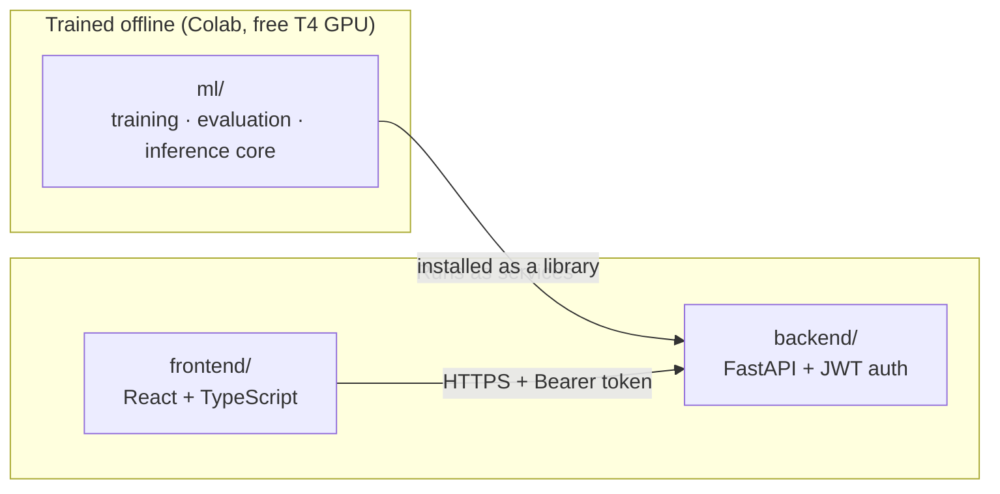

# PulmoGuard

**Selective-Prediction Chest X-Ray Triage System**

PulmoGuard is a pneumonia triage system that knows when *not* to answer.
Instead of reporting a single accuracy number on 100% of cases, it uses
**Monte Carlo Dropout** to estimate its own predictive uncertainty on every
image and **abstains** on cases it isn't confident about, flagging them for
radiologist review instead of forcing a diagnosis.

This repository contains the full system: the model training/evaluation
core, an authenticated backend API, and a web frontend — plus the CI/CD
and architecture documentation for running it as a real service, not just
a notebook.

**→ See [`docs/ARCHITECTURE.md`](docs/ARCHITECTURE.md) for diagrams and design decisions.**
**→ See [`docs/API.md`](docs/API.md) for the full API reference.**
**→ See [`docs/DEPLOYMENT.md`](docs/DEPLOYMENT.md) for Docker Compose / Fly.io / Render deploy guides.**

---

## System overview



The headline ML result is a **risk-coverage curve**: accuracy as a function
of how much of the test set the model agrees to answer.

| Coverage | Accuracy (expected shape on real data) |
|----------|----------|
| 100% (answers everything) | ~92% |
| 80% (defers hardest 20%)  | ~97%+ |
| 50% (defers hardest 50%)  | ~99%+ |

---

## Repository structure

```
pulmoguard-cv/
├── ml/                       # Training, evaluation, and inference core
│   ├── pulmoguard/           #   installable Python package
│   ├── configs/config.yaml   #   single source of truth for hyperparameters
│   ├── notebooks/            #   Colab training notebook
│   ├── scripts/              #   dataset download + batch CLI inference
│   └── tests/                #   fast, dataset-free unit tests
├── backend/                  # FastAPI service (auth, logging, serving)
│   ├── app/
│   │   ├── main.py           #   app assembly, middleware, lifecycle
│   │   ├── api/routes/       #   auth.py, predict.py, health.py
│   │   ├── core/             #   config, JWT security, logging
│   │   ├── schemas/          #   Pydantic request/response models
│   │   └── services/         #   model_service.py (wraps pulmoguard-ml)
│   ├── tests/                #   mocked API tests (no checkpoint needed)
│   └── Dockerfile
├── frontend/                 # React + TypeScript SPA
│   ├── src/
│   │   ├── api/client.ts     #   typed API client
│   │   ├── context/          #   auth state
│   │   ├── pages/            #   Login, Triage
│   │   └── components/       #   UploadDropzone, ResultCard
│   ├── nginx.conf
│   └── Dockerfile
├── docs/
│   ├── ARCHITECTURE.md       # system/container/sequence/deployment diagrams + decisions
│   ├── API.md                # endpoint reference
│   └── DEPLOYMENT.md         # Docker Compose / Fly.io / Render deploy guides
├── reverse-proxy/
│   └── nginx.conf            # single-domain proxy: routes /api,/health to backend
├── .github/workflows/
│   ├── ci.yml                # lint + test + build, on every push/PR
│   └── cd.yml                # build + push images to GHCR, on version tag
├── docker-compose.yml         # dev topology: direct ports, CORS
├── docker-compose.prod.yml    # prod topology: single reverse-proxy entrypoint
├── render.yaml                 # Render Blueprint (both services)
├── Makefile
└── ruff.toml
```

`backend/fly.toml` and `frontend/fly.toml` (Fly.io app configs) live
alongside their respective services.

---

## Quickstart

### 1. Train the model (Colab, free T4)

Open `ml/notebooks/train_colab.ipynb` in Google Colab (Runtime → T4 GPU),
run all cells. It downloads the Kaggle chest X-ray dataset, trains
EfficientNet-B0 (~30–50 min), evaluates with MC-Dropout, and saves the
checkpoint + risk-coverage plot to Google Drive.

Download the resulting `pulmoguard_best.pt` and place it at:
```
ml/outputs/checkpoints/pulmoguard_best.pt
```

### 2. Run the backend

```bash
make backend-install
cp backend/.env.example backend/.env   # edit secrets for non-local use
make backend-dev
```
API live at `http://localhost:8000`, docs at `/docs`.

### 3. Run the frontend

```bash
make frontend-install
cp frontend/.env.example frontend/.env
make frontend-dev
```
App live at `http://localhost:5173`. Default dev login: `admin` / `changeme`
(defined by the bcrypt hash in `backend/.env.example` — **change this
before any non-local deployment**).

### Or: run everything with Docker Compose

```bash
cp backend/.env.example backend/.env
docker compose up --build
```

---

## Testing

```bash
make ml-test         # 7 tests — model/uncertainty logic, no dataset needed
make backend-test    # 12 tests — API/auth logic, model service mocked
make lint            # ruff across ml/ and backend/
cd frontend && npm run build   # typecheck + production build
```

All of the above are also run automatically in CI on every push (see
`.github/workflows/ci.yml`).

---

## Why uncertainty-aware triage matters

A model that is confidently wrong is more dangerous in a clinical setting
than one that says "I'm not sure." Standard softmax scores from a
deterministic network are well known to be overconfident. PulmoGuard
addresses this directly:

1. **Monte Carlo Dropout** ([Gal & Ghahramani, 2016](https://arxiv.org/abs/1506.02142)) keeps dropout active at inference and runs multiple stochastic forward passes; disagreement across passes approximates epistemic uncertainty.
2. **Predictive entropy**, normalized to `[0, 1]`, is the uncertainty score.
3. **A configurable abstention threshold** trades off coverage vs. accuracy without retraining — tune it against `ml/outputs/plots/risk_coverage_curve.png` for your risk tolerance.
4. **Expected Calibration Error (ECE)** is reported as a secondary diagnostic.

The backend surfaces this as a first-class field in every API response
(`abstain: true/false`), and the frontend gives it a distinct visual
treatment (an amber warning banner) — the abstention decision is never
buried in a confidence number the user has to interpret themselves.

---

## Security notes

- **Auth:** JWT bearer tokens (OAuth2 password grant), a single configured
  admin credential (bcrypt-hashed). This system is scoped as a
  single-operator internal tool, not multi-tenant SaaS — see
  `docs/ARCHITECTURE.md §5.1` for the migration path to a real user store.
- **Secrets:** `JWT_SECRET_KEY` and `ADMIN_PASSWORD_HASH` ship with
  obviously-insecure development defaults in `.env.example` files. **Never**
  deploy with the defaults — generate real values as documented inline in
  each `.env.example`.
- **Token storage:** the frontend authenticates via an httpOnly,
  `SameSite=Strict` session cookie — the JWT is never exposed to page
  JavaScript at all. See `docs/ARCHITECTURE.md §5.3` for the full
  rationale, including the CSRF analysis and the known limitation
  (no server-side token revocation before natural expiry).
- **Rate limiting:** enforced per-IP on every endpoint (30/min default),
  with a stricter limit on `/api/v1/auth/token` (10/min) to blunt
  credential brute-forcing. See `docs/API.md` and `docs/ARCHITECTURE.md §5.7`.

---

## Limitations & responsible use

- Trained on a single public pediatric dataset (Guangzhou Women and
  Children's Medical Center) — performance will likely degrade on adult
  populations, different scanner hardware, or different demographics
  without additional fine-tuning and validation.
- MC-Dropout approximates epistemic uncertainty but does not capture every
  failure mode (e.g. a confidently-wrong prediction on an in-distribution
  but mislabeled training example).
- **This is a research/portfolio project, not a validated medical device.**
  It is not intended for clinical use without regulatory clearance,
  extensive external validation, and clinician oversight.

## License

MIT — see `LICENSE`.
