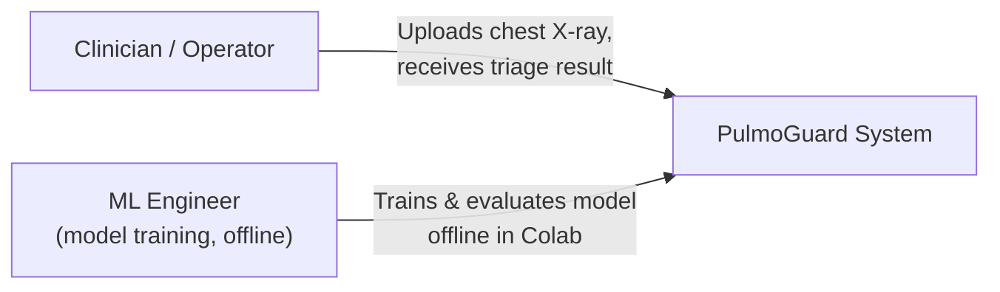
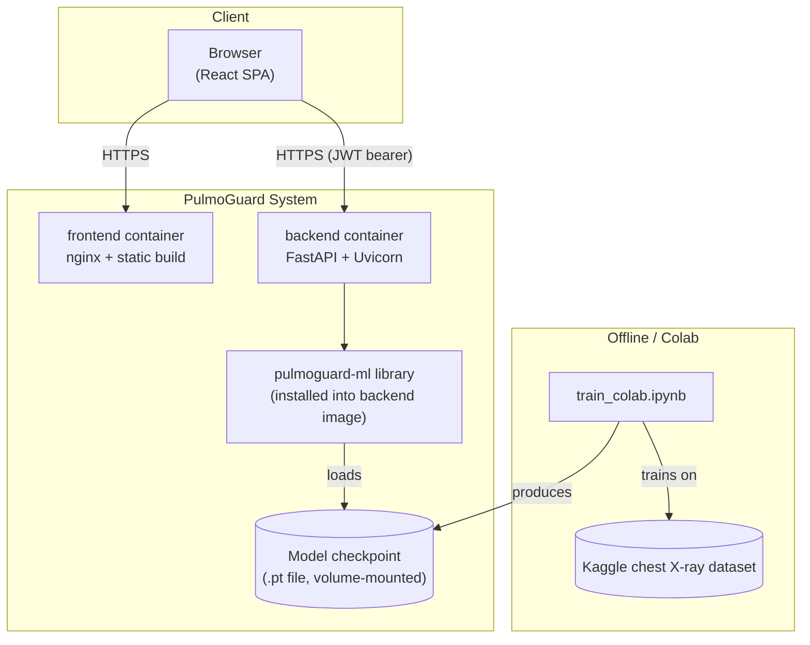
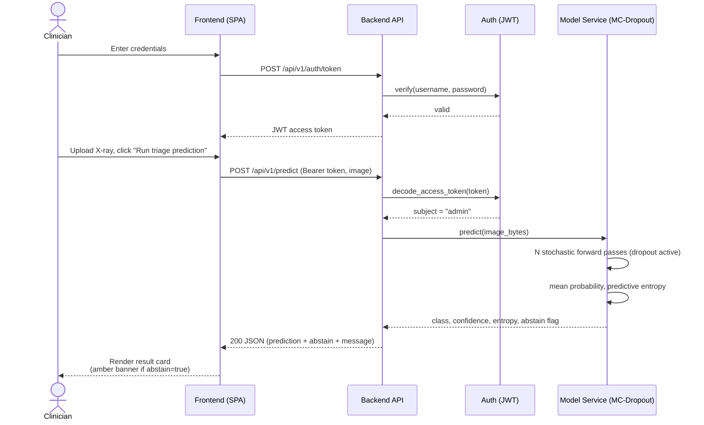
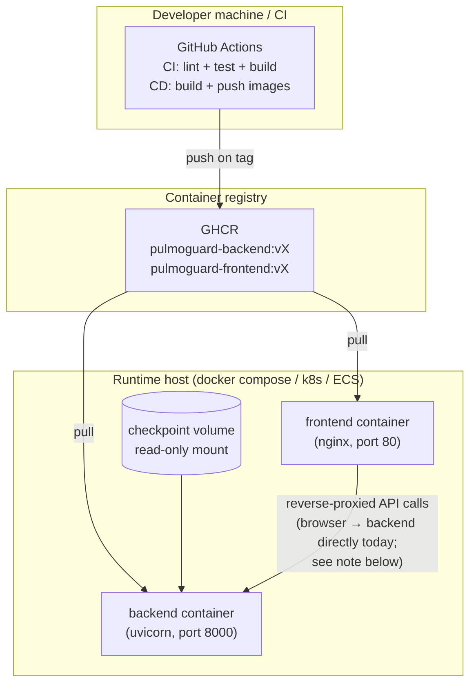

# PulmoGuard — Architecture

This document describes PulmoGuard's system architecture at four levels of
detail (roughly following the C4 model): system context, containers,
runtime sequence, and deployment. It also records the key architectural
decisions and their tradeoffs, and the migration paths for the parts of the
system that are intentionally simple today.

---

## 1. System context

PulmoGuard is a single-tenant, internal clinical-triage decision-support
tool. One operator (e.g. a clinic or a research team) runs one deployment;
there is no multi-tenancy, and the single-admin-user auth model (Section 5)
follows from that scope. The system does not connect to any hospital PACS,
EHR, or third-party service — a clinician uploads an image and reads a
result. That boundary matters: everything the model sees comes from a
manual upload, so there is no ingestion pipeline, no PHI store, and no
integration surface to secure beyond the API itself.

## 2. Containers

The system is split into three independently-deployable units:

- **`ml/`** — not a running service. A Python library plus training/
  evaluation scripts, packaged as `pulmoguard-ml` and installed as a
  dependency of `backend/`. This is the seam that lets training happen on
  a free Colab T4 GPU while inference happens on ordinary CPU hardware:
  the same code (`pulmoguard.infer.PulmoGuardPredictor`) runs in both
  places, so there is no train/serve skew.
- **`backend/`** — a FastAPI service exposing authenticated HTTP endpoints.
  Owns auth, request validation, logging, and the model lifecycle. Never
  talks to the frontend's internals and never assumes anything about who
  is calling it beyond "holds a valid JWT."
- **`frontend/`** — a static single-page app (React + TypeScript), built to
  static files and served by nginx. Talks to the backend exclusively over
  its public HTTP API — no shared code, no server-side rendering, no
  backend-for-frontend layer. This keeps the frontend replaceable
  (a mobile app or a different SPA could call the same API unchanged).

## 3. Runtime sequence: authenticated prediction

The full request lifecycle for the core use case, showing where auth is
enforced and where the abstention decision is made.

## 4. Deployment topology

**Note on the frontend→backend path:** the frontend currently calls the
backend's public URL directly from the browser (`VITE_API_BASE_URL`),
relying on the backend's CORS policy. For a production deployment behind a
single domain, put both services behind a reverse proxy (nginx, Traefik,
or a cloud load balancer) that routes `/api/*` to the backend and
everything else to the frontend — this removes the need for CORS entirely
and lets both services share one TLS certificate.

---

## 5. Key architectural decisions

### 5.1 Why a single-admin-user auth model, not a full user store

This is scoped as an internal tool for one clinical operator, not a
multi-tenant SaaS product. A username/password checked against one
bcrypt-hashed credential in configuration is proportionate to that scope
and has no database to secure, migrate, or back up.

**Migration path, if this grows:** replace `core/security.py`'s
`authenticate_admin()` with a lookup against a `users` table (Postgres +
SQLAlchemy), add a `role`/`scopes` claim to the JWT payload, and gate
routes with scope-aware dependencies instead of the current flat
`get_current_user`. If the organization already has an identity provider
(Okta, Auth0, Azure AD), prefer delegating entirely via OIDC over building
a local user store.

### 5.2 Why JWT (HS256, symmetric) rather than sessions or OAuth2 + IdP

Stateless bearer tokens mean the backend needs no session store (no Redis,
no sticky sessions) and scales horizontally without shared state. HS256
with a single secret is appropriate for a single-service deployment where
the same process issues and verifies tokens.

**Migration path:** once more than one service needs to verify tokens
(e.g. splitting out a separate reporting service), switch to RS256
asymmetric signing so only the auth-issuing component holds the private
key and other services hold only the public key for verification.

### 5.3 Why the JWT lives in `sessionStorage`, not an httpOnly cookie

`sessionStorage` was chosen for simplicity: no cookie/CSRF plumbing, and
the token naturally clears when the tab closes. The known tradeoff is that
`sessionStorage` is readable by any JavaScript on the page, so it's more
exposed to XSS than an httpOnly cookie would be.

**Migration path:** for a deployment handling real patient data, move the
token to an httpOnly, `Secure`, `SameSite=Strict` cookie set directly by
the backend's `/auth/token` response, and add CSRF-token double-submit
protection on state-changing requests.

### 5.4 Why MC-Dropout rather than a deep ensemble or conformal prediction

MC-Dropout was chosen because it requires no architectural changes beyond
a dropout layer that is already useful for regularization, needs no extra
training (unlike a deep ensemble, which means training N models), and runs
in a single T4 Colab session inside a one-day project budget.

**Tradeoff, recorded honestly:** MC-Dropout is a weaker uncertainty
estimate than a true deep ensemble or split conformal prediction — it
approximates a distribution over one model's weights, not disagreement
across genuinely different models. If uncertainty quality becomes the
bottleneck rather than latency/cost, conformal prediction (which gives
formal coverage guarantees) is the natural next step and is a
post-processing layer, not a retraining exercise — it could be added to
`evaluate.py`/`infer.py` without touching `train.py` at all.

### 5.5 Why checkpoints are volume-mounted, not baked into the image

Model weights (tens of MB) change on a different cadence than application
code and would bloat every backend image rebuild if baked in. Mounting the
checkpoint as a read-only volume means a new model version is a config/
volume change, not an image rebuild — and the same backend image is valid
across model versions unless the architecture itself changes.

### 5.6 Why the frontend is a plain SPA with no server-side rendering

There is no SEO surface to optimize (it's an authenticated internal tool)
and no content that needs to render before JS loads. A static SPA served
by nginx is the simplest thing that satisfies the requirements, and it
keeps the frontend fully decoupled from the backend's runtime.

---

## 6. Non-goals (explicitly out of scope)

- **Multi-tenancy / multiple organizations sharing one deployment.**
- **PHI storage or an audit-logged medical record.** Images are processed
  in memory for a single request and never persisted by the backend.
- **Regulatory clearance.** This is a research/portfolio system; see the
  disclaimer in the root README. Achieving clinical-grade certification
  (e.g. FDA 510(k) / SaMD) would require a clinical validation study,
  a quality management system, and traceable model versioning that this
  project does not implement.
