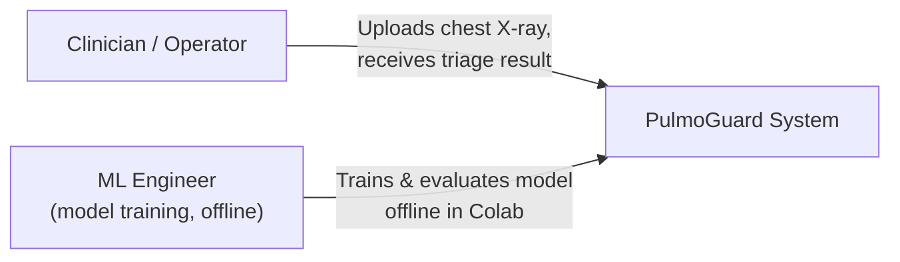
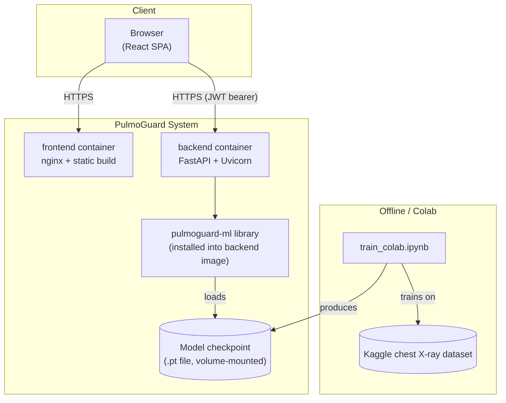
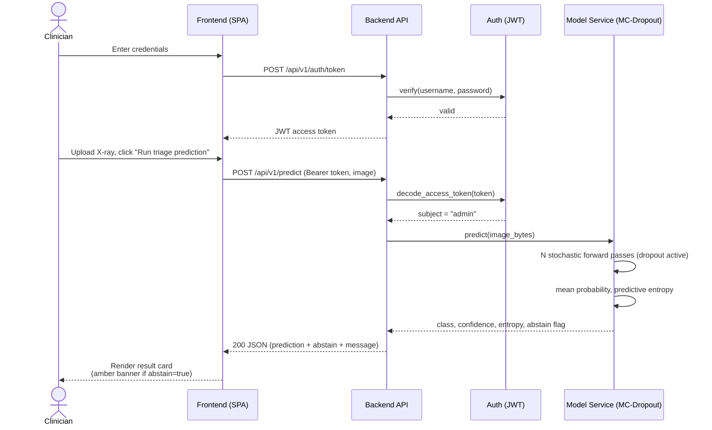
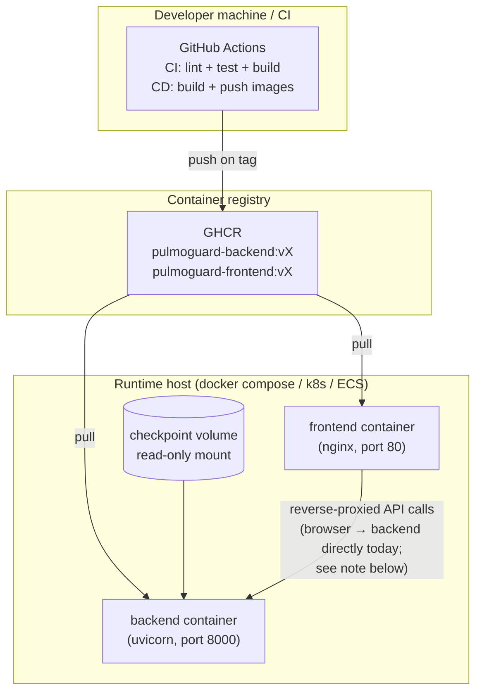

# PulmoGuard — Architecture

This document describes PulmoGuard's system architecture at four levels of
detail (roughly following the C4 model): system context, containers,
runtime sequence, and deployment. It also records the key architectural
decisions and their tradeoffs, and the migration paths for the parts of the
system that are intentionally simple today.

---

## 1. System context

PulmoGuard is a single-tenant, internal clinical-triage decision-support
tool. One operator (e.g. a clinic or a research team) runs one deployment;
there is no multi-tenancy, and the single-admin-user auth model (Section 5)
follows from that scope. The system does not connect to any hospital PACS,
EHR, or third-party service — a clinician uploads an image and reads a
result. That boundary matters: everything the model sees comes from a
manual upload, so there is no ingestion pipeline, no PHI store, and no
integration surface to secure beyond the API itself.

## 2. Containers

The system is split into three independently-deployable units:

- **`ml/`** — not a running service. A Python library plus training/
  evaluation scripts, packaged as `pulmoguard-ml` and installed as a
  dependency of `backend/`. This is the seam that lets training happen on
  a free Colab T4 GPU while inference happens on ordinary CPU hardware:
  the same code (`pulmoguard.infer.PulmoGuardPredictor`) runs in both
  places, so there is no train/serve skew.
- **`backend/`** — a FastAPI service exposing authenticated HTTP endpoints.
  Owns auth, request validation, logging, and the model lifecycle. Never
  talks to the frontend's internals and never assumes anything about who
  is calling it beyond "holds a valid JWT."
- **`frontend/`** — a static single-page app (React + TypeScript), built to
  static files and served by nginx. Talks to the backend exclusively over
  its public HTTP API — no shared code, no server-side rendering, no
  backend-for-frontend layer. This keeps the frontend replaceable
  (a mobile app or a different SPA could call the same API unchanged).

## 3. Runtime sequence: authenticated prediction

The full request lifecycle for the core use case, showing where auth is
enforced and where the abstention decision is made.

## 4. Deployment topology

**Note on the frontend→backend path:** the recommended production topology
is the single-domain reverse proxy in `reverse-proxy/nginx.conf` (wired up
in `docker-compose.prod.yml`), which routes `/api/*` and `/health/*` to the
backend and everything else to the frontend's static build. This removes
the need for CORS entirely (the browser never makes a cross-origin
request) and lets the auth cookie's `SameSite=Strict` attribute work
without any special-casing, since both services share one origin. The
simpler `docker-compose.yml` (two directly-exposed ports, CORS-mediated)
remains available for local development, where the extra proxy hop adds
friction without adding safety. See `docs/DEPLOYMENT.md` for the concrete
deploy paths (Docker Compose, Fly.io, Render).

---

## 5. Key architectural decisions

### 5.1 Why a single-admin-user auth model, not a full user store

This is scoped as an internal tool for one clinical operator, not a
multi-tenant SaaS product. A username/password checked against one
bcrypt-hashed credential in configuration is proportionate to that scope
and has no database to secure, migrate, or back up.

**Migration path, if this grows:** replace `core/security.py`'s
`authenticate_admin()` with a lookup against a `users` table (Postgres +
SQLAlchemy), add a `role`/`scopes` claim to the JWT payload, and gate
routes with scope-aware dependencies instead of the current flat
`get_current_user`. If the organization already has an identity provider
(Okta, Auth0, Azure AD), prefer delegating entirely via OIDC over building
a local user store.

### 5.2 Why JWT (HS256, symmetric) rather than sessions or OAuth2 + IdP

Stateless bearer tokens mean the backend needs no session store (no Redis,
no sticky sessions) and scales horizontally without shared state. HS256
with a single secret is appropriate for a single-service deployment where
the same process issues and verifies tokens.

**Migration path:** once more than one service needs to verify tokens
(e.g. splitting out a separate reporting service), switch to RS256
asymmetric signing so only the auth-issuing component holds the private
key and other services hold only the public key for verification.

### 5.3 Why the session lives in an httpOnly cookie, not `sessionStorage`

The frontend authenticates via an httpOnly, `SameSite=Strict` cookie
(`pulmoguard_access_token`) set directly by the backend's `/auth/token`
response, rather than storing the raw JWT in `sessionStorage` for the
page's own JavaScript to attach manually. `httpOnly` means the token is
never readable by any script running on the page at all, which removes an
entire class of XSS-driven token theft — an injected script can still
make an authenticated request (the browser attaches the cookie
automatically), but it can never exfiltrate the token itself to a
third party.

- **`SameSite=Strict`** withholds the cookie on genuinely cross-site
  requests. Frontend and backend are same-site by the browser's
  definition (same registrable domain, regardless of port/subdomain) both
  in local dev (`localhost:5173` / `localhost:8000`) and in the
  recommended single-domain production topology (Section 4), so this
  needed no further CSRF-token plumbing on top of it for this system's
  threat model — see the caveat below.
- **`Secure`** is forced on outside `ENVIRONMENT=development`, since a
  `Secure` cookie is refused by browsers over plain HTTP. This is why TLS
  termination in front of the stack is a hard requirement in any real
  deployment — see the TLS note in `reverse-proxy/nginx.conf`.
- **No client-side token storage at all.** The frontend's `AuthContext`
  doesn't hold a token; it asks the backend "am I logged in?" via
  `GET /api/v1/auth/me` on page load, which succeeds or fails purely based
  on whatever cookie the browser attaches.
- **API/CLI clients are unaffected.** `/auth/token`'s JSON response still
  includes the raw `access_token`, and `get_current_user` (`api/deps.py`)
  accepts either the cookie or a standard `Authorization: Bearer` header —
  curl, scripts, and Swagger UI's "Authorize" button all keep working
  exactly as before.

**Known limitation, recorded honestly:** stateless JWTs can't be
server-side revoked before they expire without maintaining a token
blocklist, which this system doesn't implement — `/auth/logout` clears
the browser's cookie (ending the *session* a user experiences), but a
copied token would technically remain valid against the API until its
natural expiry (`ACCESS_TOKEN_EXPIRE_MINUTES`, default 60). This is an
acceptable tradeoff for a single-operator internal tool; a token
blocklist (checked in `decode_access_token`) or a move to short-lived
access tokens + refresh tokens is the standard fix if that risk profile
changes.

**CSRF, considered explicitly:** `SameSite=Strict` alone is standard,
adequate CSRF protection for this system because every state-changing
request is XHR/fetch from the SPA's own JS, not a classic HTML form post —
there is no cross-site page anywhere that could trigger a authenticated
POST simply by the victim's browser visiting it. If this API ever needs to
accept requests from a genuinely different site (e.g. an OAuth-style
redirect flow), add explicit double-submit CSRF tokens at that point;
don't rely on `SameSite` alone once that assumption changes.

### 5.4 Why MC-Dropout rather than a deep ensemble or conformal prediction

MC-Dropout was chosen because it requires no architectural changes beyond
a dropout layer that is already useful for regularization, needs no extra
training (unlike a deep ensemble, which means training N models), and runs
in a single T4 Colab session inside a one-day project budget.

**Tradeoff, recorded honestly:** MC-Dropout is a weaker uncertainty
estimate than a true deep ensemble or split conformal prediction — it
approximates a distribution over one model's weights, not disagreement
across genuinely different models. If uncertainty quality becomes the
bottleneck rather than latency/cost, conformal prediction (which gives
formal coverage guarantees) is the natural next step and is a
post-processing layer, not a retraining exercise — it could be added to
`evaluate.py`/`infer.py` without touching `train.py` at all.

### 5.5 Why checkpoints are volume-mounted, not baked into the image

Model weights (tens of MB) change on a different cadence than application
code and would bloat every backend image rebuild if baked in. Mounting the
checkpoint as a read-only volume means a new model version is a config/
volume change, not an image rebuild — and the same backend image is valid
across model versions unless the architecture itself changes.

### 5.6 Why the frontend is a plain SPA with no server-side rendering

There is no SEO surface to optimize (it's an authenticated internal tool)
and no content that needs to render before JS loads. A static SPA served
by nginx is the simplest thing that satisfies the requirements, and it
keeps the frontend fully decoupled from the backend's runtime.

### 5.7 Why rate limiting is keyed by IP, in-memory, with a stricter override on auth

[slowapi](https://github.com/laurentS/slowapi) enforces `RATE_LIMIT_PER_MINUTE`
on every route by default, with `/api/v1/auth/token` carrying its own
stricter `AUTH_RATE_LIMIT_PER_MINUTE` — that split exists because the two
endpoints face different threat models: `/predict` abuse is mostly a cost/
availability concern, while `/auth/token` is the specific endpoint a
credential brute-force attempt would target and warrants a tighter limit.

Keying by client IP (`get_remote_address`) rather than by authenticated
user was the simplest option that still covers the auth endpoint itself,
where no user identity exists yet — using one key function everywhere
keeps the mental model consistent instead of switching strategies per route.

**Known limitations, recorded honestly:**
- Clients behind a shared NAT or corporate proxy share one IP's quota.
  Acceptable for a single-operator internal tool; would need a per-user
  (JWT-subject-keyed) limit on authenticated routes if this becomes
  multi-tenant.
- The default in-memory storage backend means limits reset on every
  backend restart and are **not shared across multiple replicas** — each
  replica enforces its own independent quota, so the effective limit
  scales with replica count. This is fine for the single-instance
  deployment this project targets.

**Migration path:** swap the `Limiter`'s storage to Redis
(`storage_uri="redis://..."`, already stubbed as a comment in
`backend/app/core/rate_limit.py`) the moment the backend runs as more than
one replica — no other code changes are required, since slowapi reads
from whatever storage backend it's configured with transparently.

---

## 6. Non-goals (explicitly out of scope)

- **Multi-tenancy / multiple organizations sharing one deployment.**
- **PHI storage or an audit-logged medical record.** Images are processed
  in memory for a single request and never persisted by the backend.
- **Regulatory clearance.** This is a research/portfolio system; see the
  disclaimer in the root README. Achieving clinical-grade certification
  (e.g. FDA 510(k) / SaMD) would require a clinical validation study,
  a quality management system, and traceable model versioning that this
  project does not implement.
